# ECS 云服务器
[参考网址](https://help.aliyun.com/product/25365.html?spm=a2c4g.11186623.6.540.6a3050bf6nTzLH)

## 产品概述
#### 云服务器，购买后实例化即可使用
#####  多种规格型号
###### 特性：通用型、网络增强、计算增强、内存型及上述特性特定组合
###### 规格：nano, small, large, xlarge(nxlarge)
##### 涉及的资源

##### 地域概念: 只有处于相同的地域和可用区的云服务，才能构建专用网络（VPC)，for combination use
##### 可以通过：控制台（阿里网页或移动APP），API，CLI（阿里），或常规SSH途径登录使用（需开通安全组及外网IP）

## 费用说明
#### 价格构成
###### 区分企业用户及个人用户（个人性价比高，企业须商务合作）
###### OS计费，部分OS收费使用，如Window和RedHat
###### 计算性能（即云服务器规格）
###### 存储容量（磁盘）
###### 网络（VPC）、I/O优化（改配置是否需要重启实例）、带宽流量（按M计）等
#### 结算方式
###### 预付费（支付后使用，更优惠）
###### 按量付费（使用后支付）
###### 其他优惠（如企业商业洽谈，个人用户试用）
####  [价格参考](https://ecs-buy.aliyun.com/wizard#/prepay/)
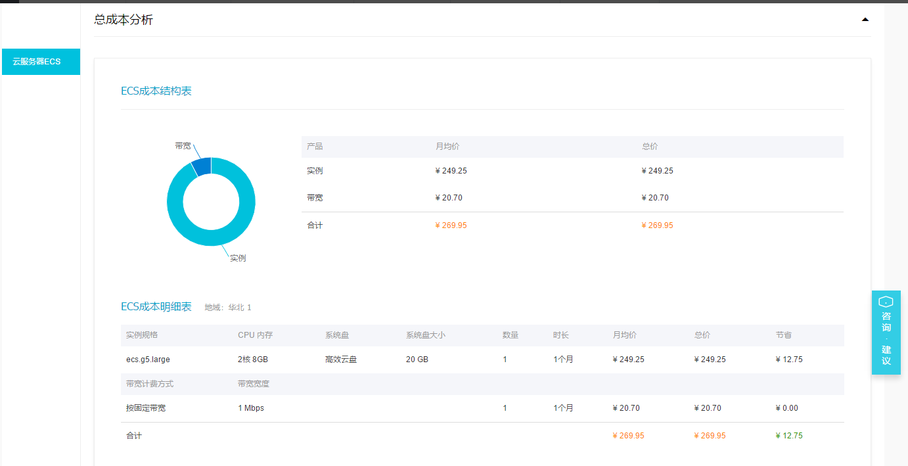
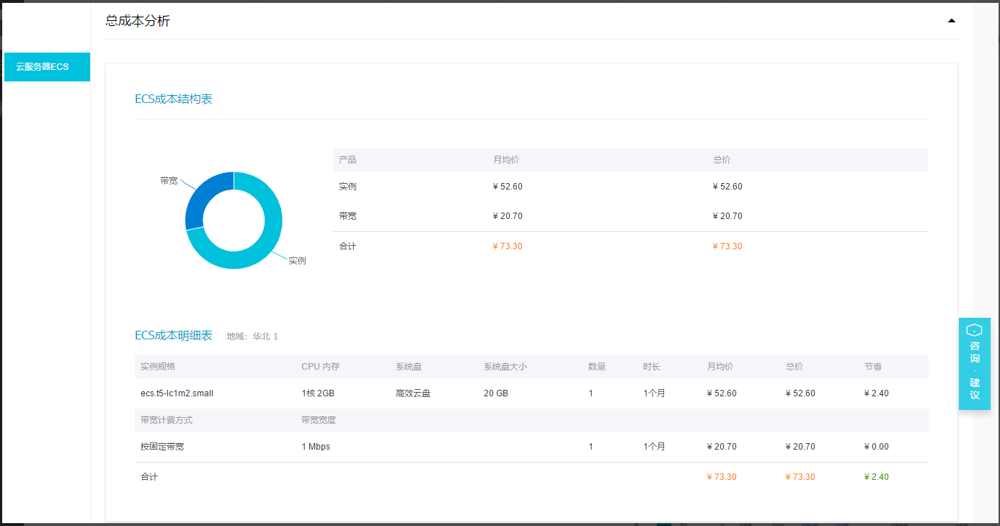

## 使用说明
#### 新建实例
###### 1. 购买云服务器（可选购买后立即启动）
###### 2. 登录阿里云-管理控制台
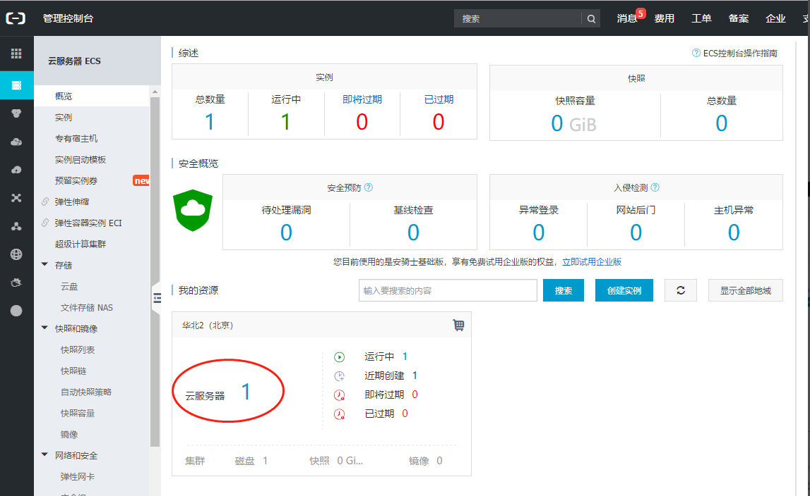
###### 3. 找到ECS实例，启动

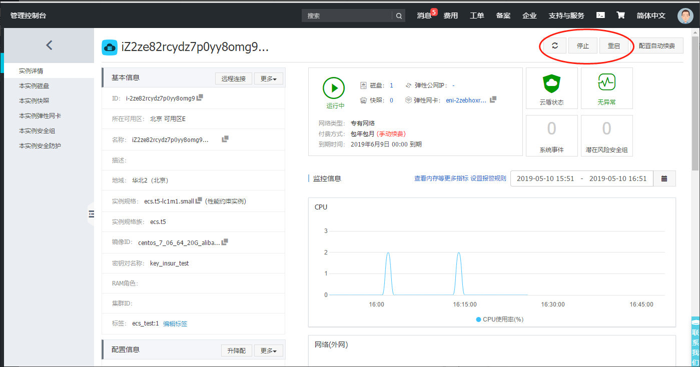
#### 安全组
###### 1 进入安全组配置界面
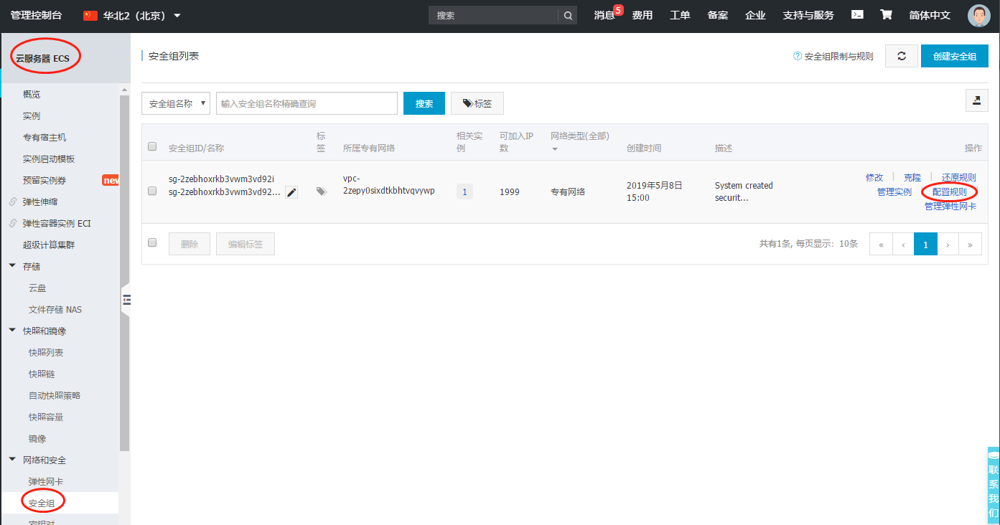
###### 2 按需配置“iptables”， linux确保22，windows确保3389
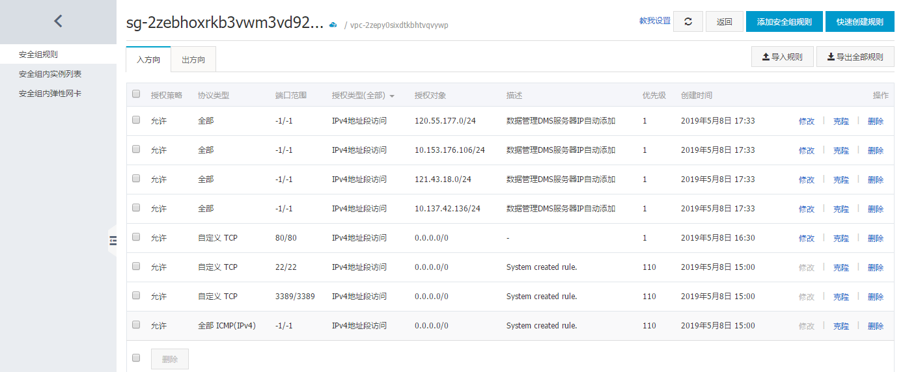
#### 密钥对
###### 注意ECS实例绑定密钥对后，无法通过账号密码登录，需要解绑并（可能）重启
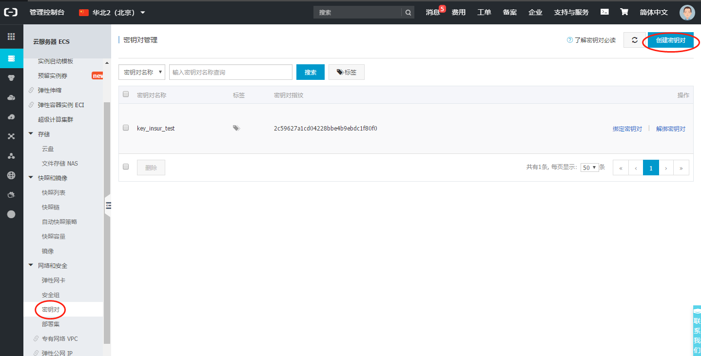
###### 仅在密钥对创建时可以下载！
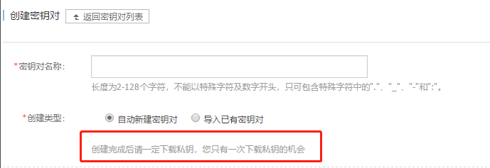

#### SSH连接
###### 页面提供的远程连接
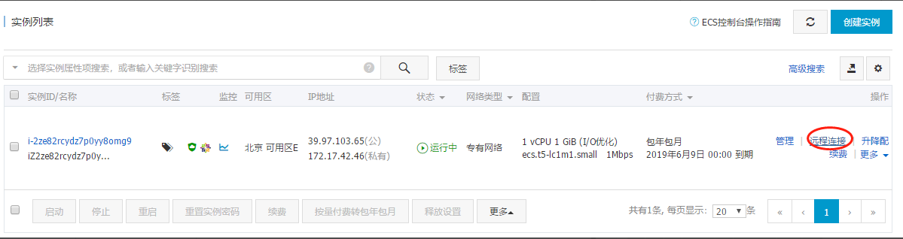
###### 本地SSH工具，通过ECS的外网IP登录
###### 关闭外网IP后，可通过VPN（收费）接入VPC使用内部IP登录
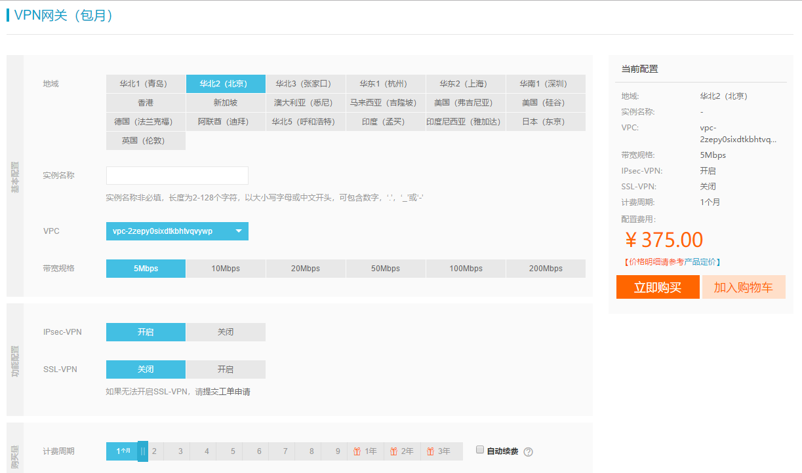

## 部署说明
#### VPC
###### 如非单独使用云服务器，需要通过VPC才能组合部署，需开通VPC服务（VPC本身貌似不收费）
###### VPC详情页
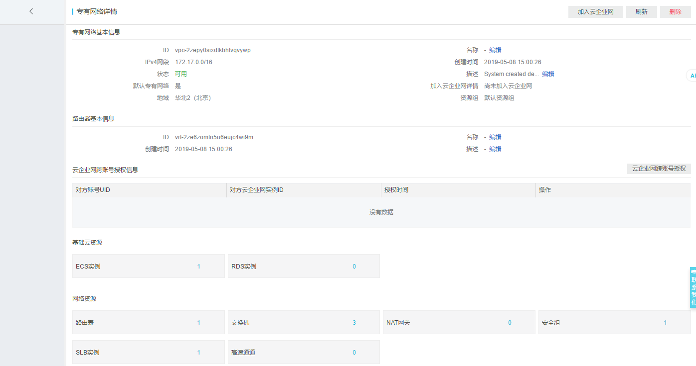
#### SLB 详见SLB_Note

