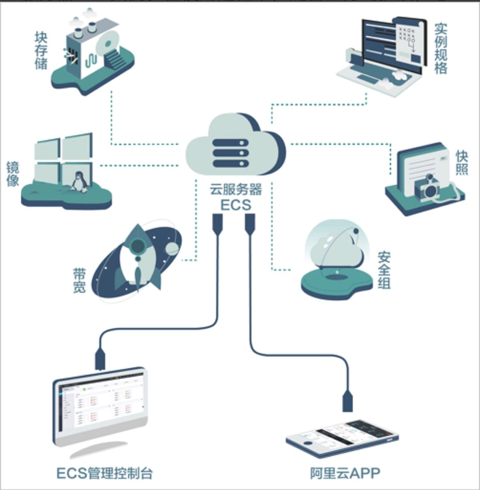

## ECS 云服务器
### 产品概述
#### 云服务器，购买后实例化即可使用
- 多种规格型号
特性：通用型、网络增强、计算增强、内存型及上述特性特定组合
规格：nano, small, large, xlarge(nxlarge)
- 涉及的资源

- 地域概念
- 可以通过：控制台（阿里网页或移动APP），API，CLI（阿里），或常规SSH途径登录使用（需开通安全组及外网IP）

### 费用说明
### 使用说明
#### 新建
#### accessKey
#### SSH连接
### 部署说明
#### VPC